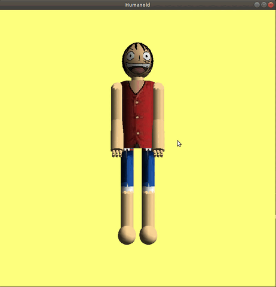

# Camera Movement



## keys 
   * `7` `8`<br>
   forward and back
## Functions of movement 
```C++
void Left() {
    // implement camera rotation arround vertical window screen axis to the left
    // used by mouse and left arrow
    rotatePoint(up, 0.1, eye);
}

void Right() {
    // implement camera rotation arround vertical window screen axis to the right
    // used by mouse and right arrow
    rotatePoint(up, -0.1, eye);
}


void Up() {
    // implement camera rotation arround horizontal window screen axis +ve
    // used by up arrow
    for (int i= 0;i<3;i++){
        look[i] = center[i] - eye[i];
    }
    crossProduct(look, up, horizontal);
    normalize(horizontal);
    rotatePoint(horizontal, 0.1, eye);
    rotatePoint(horizontal, 0.1, up);
}

void Down() {
    // implement camera rotation arround horizontal window screen axis
    for (int i= 0;i<3;i++){
        look[i] = center[i] - eye[i];
    }
    crossProduct(look, up, horizontal);
    normalize(horizontal);
    rotatePoint(horizontal, -0.1, eye);
    rotatePoint(horizontal, -0.1, up);
}


void moveForward() {

    GLfloat direction[3] = {0, 0, 0};

    direction[0] = center[0] - eye[0];
    direction[1] = center[1] - eye[1];
    direction[2] = center[2] - eye[2];

    eye[0] += direction[0] * 0.1;
    eye[1] += direction[1] * 0.1;
    eye[2] += direction[2] * 0.1;

    center[0] += direction[0] * 0.1;
    center[1] += direction[1] * 0.1;
    center[2] += direction[2] * 0.1;

    glutPostRedisplay();
}

void moveBack() {
    GLfloat direction[3] = {0, 0, 0};

    direction[0] = center[0] - eye[0];
    direction[1] = center[1] - eye[1];
    direction[2] = center[2] - eye[2];

    eye[0] -= direction[0] * 0.1;
    eye[1] -= direction[1] * 0.1;
    eye[2] -= direction[2] * 0.1;

    center[0] -= direction[0] * 0.1;
    center[1] -= direction[1] * 0.1;
    center[2] -= direction[2] * 0.1;

    glutPostRedisplay();

}
```
        